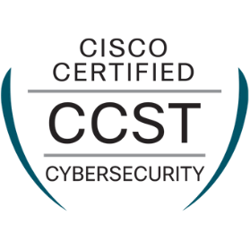

<!--DIVISOR-->

<!--TITULO-->

    <h1 style="display: inline-block">Hi, I'm Lucía </h1>

    
📠  I have completed a Computer Engineering degree and hold a Master's in Cybersecurity 

    
💻   Cybersecurity passionate and independent learner, although I also enjoy web and application development

    
⚡   Mainly interested in pentesting and forensics
    
🏃🏻‍♀️   Outside the tech world, I love doing any kind of sport, especially football and CrossFit⚽🏋🏻‍♀️

    
💬   I'm always open to connect and collaborate with others. You can reach me on LinkedIn: www.linkedin.com/in/luciarubiohernandez

<!--CIBERSEGURIDAD-->

    <h2 style="display: inline-block">👾Sec Tools</h2>

<!--Pentesting-->

  
  
  
  
  
  
  
  
  
  

<!--Forensics-->

  
    
  
  
    
  
  
    
  

<!--OTRAS TECNGOLOGÍAS-->

    <h2 style="display: inline-block">👩🏽‍💻Other Technologies That I Know</h2>
    
    
    

<!--CERTIFICACIONES-->

    <h2 style="display: inline-block">🏅Certifications</h2>
    
    
    
    

<!--WORKING ON-->

  <h2 style="display: inline-block">🛠️Working on</h2>
   
   

<!-- CONTACTO -->

    <h2 style="display: inline-block">🌐Contact</h2>

<!--Icons and Links-->

    

<!--Divisor-->

